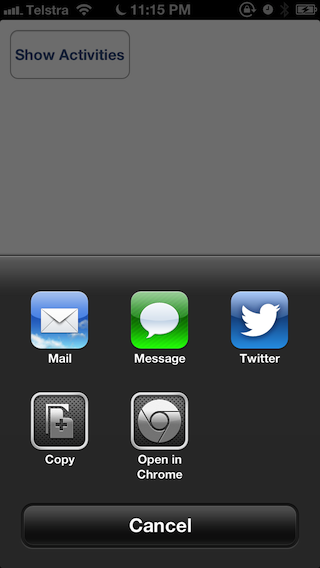

# ARChromeActivity

#### A UIActivity subclass for opening URLs in Google Chrome.

## Usage

Typical usage will look something like this:

	NSURL *urlToShare = [NSURL URLWithString:@"http://alextrob.net/"];
	NSArray *activityItems = [NSArray arrayWithObject:urlToShare];

	ARChromeActivity *chromeActivity = [[ARChromeActivity alloc] init];
	NSArray *applicationActivities = [NSArray arrayWithObject:chromeActivity];

	UIActivityViewController *activityVC = [[UIActivityViewController alloc] initWithActivityItems:activityItems
																			 applicationActivities:applicationActivities];

	[self presentViewController:activityVC animated:YES completion:nil];

Have a look at the demo app to see it in context.

